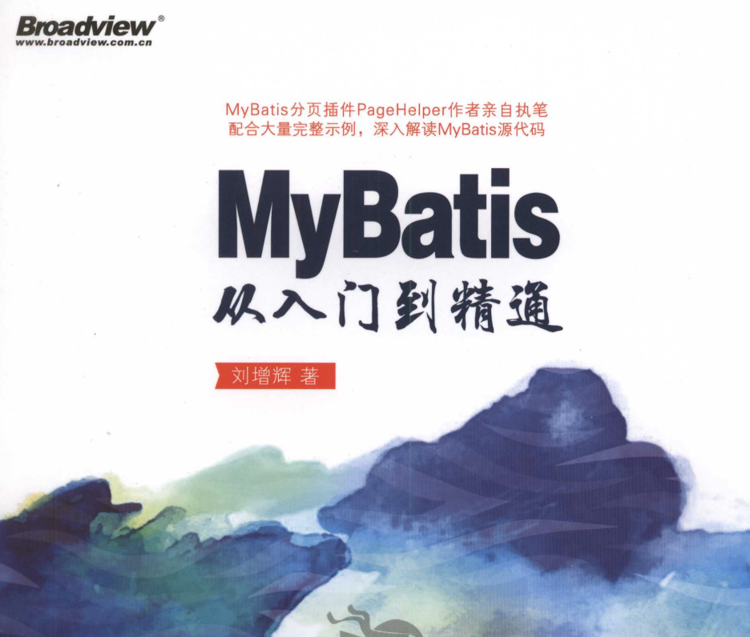

### 参考的开源项目：

项目的开源文档：http://www.macrozheng.com/#/README

项目地址：https://github.com/macrozheng/mall

会记录练习时的笔记，以及一些自己的思考。

### mall整合SpringBoot+Mybatis搭建基本骨架

参考书籍：MyBatis从入门到精通，书籍还没看完，看了下项目用到的技术。

遇到的问题：mybatis生成的mapper重复

解决：https://github.com/dlagez/java-note-mac/blob/master/javaweb/%E9%94%99%E8%AF%AF%E8%AE%B0%E5%BD%95/3.mybatisGenerater%E7%94%9F%E6%88%90mapper%E9%87%8D%E5%A4%8D.md

### mall整合Swagger-UI实现在线API文档

没有遇到问题

### mall整合Redis实现缓存功能

没有遇到问题

### mall整合SpringSecurity和JWT实现认证和授权

对于SpringSecurity和JWT不太了解。所以阅读了几篇参考文章。

参考文章：

阮一峰大佬的jwt讲解：https://www.ruanyifeng.com/blog/2018/07/json_web_token-tutorial.html

芋道大佬源码SpringSecurity解析：https://www.iocoder.cn/Spring-Boot/Spring-Security/?github

### mall整合Elasticsearch实现商品搜索

Elasticsearch以前了解过，但是没有具体学习过，这几天在学习Elasticsearch基本使用 2021-09-16。

### mall整合了日志记录

完成这个功能时记录了一些类的使用：

ThreadLocal：https://blog.csdn.net/zphuangtang/article/details/120421790

RequestContextHolder：https://blog.csdn.net/zphuangtang/article/details/120421823

这个功能并不是很难，使用到了传统的servlet技术，大多数操作都是HttpServletRequest request完成。